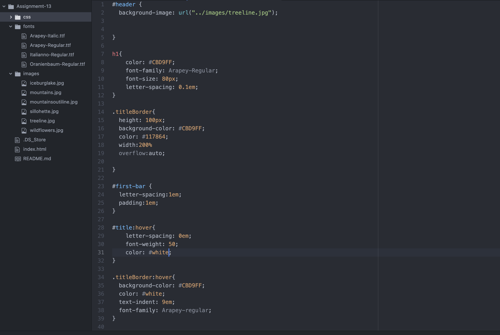
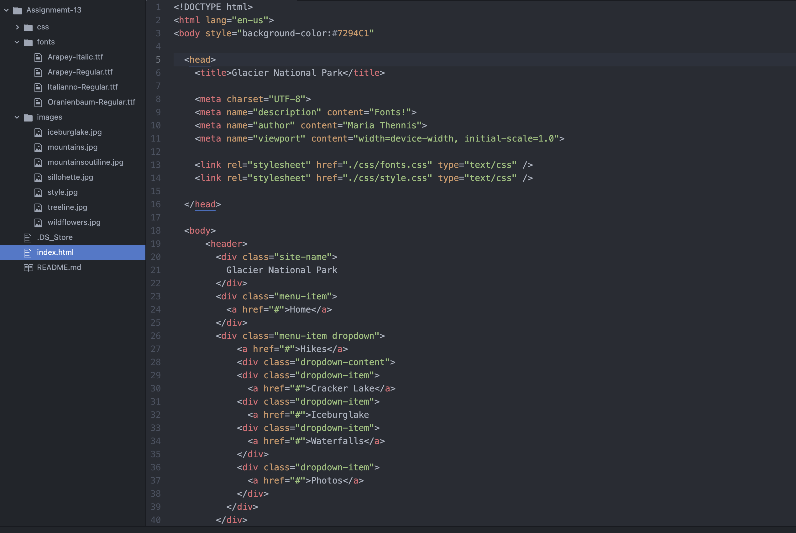
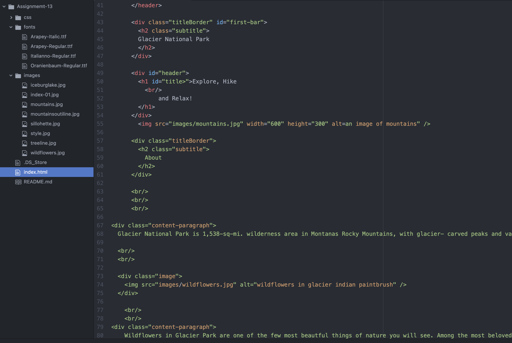
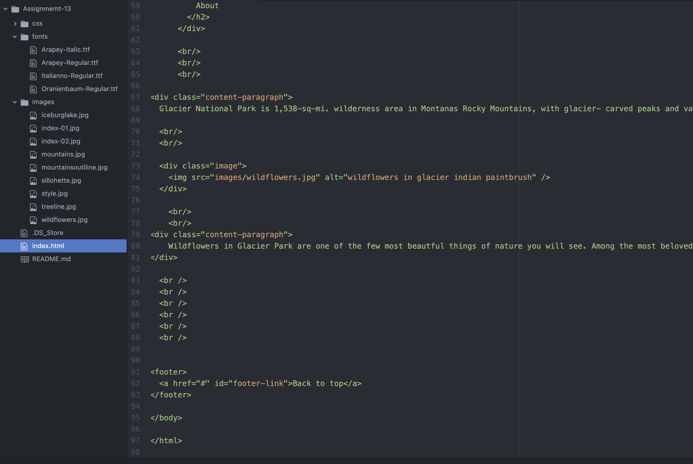

What is the goal of your website? (Think in terms of your user -- why might they visit your site?)
The goal of  my website is to have people who love glacier visit the page to find some amazing hikes and to know about them and why i love them, so they too can look into hiking these certain trails. ill have pages of hikes and then one page designated to hikes with waterfalls and one page for photos
Why is responsive web design important?
  its important because it allows your website content to follow freely across alll screen resolutions and sizes so it can look goof on an iphone or computer

