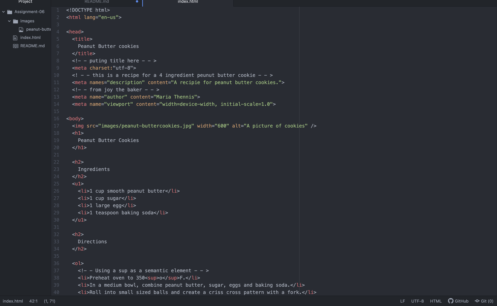

The difference between semantic and structural mark up
  1. A structural markup embeds information about the structure of a document, where the semantic markup is used to reinforce the information in a document. A semantic markup may be used to place emphasis on a word or phrase.
  A screenshot of work

   
