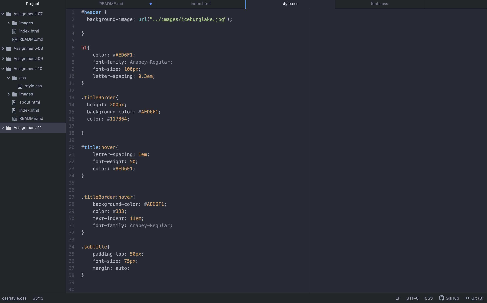
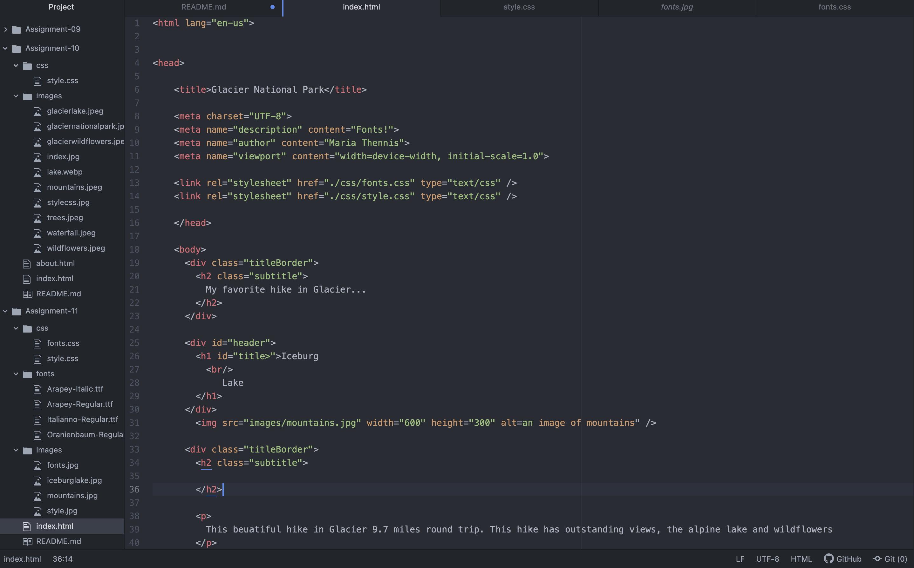
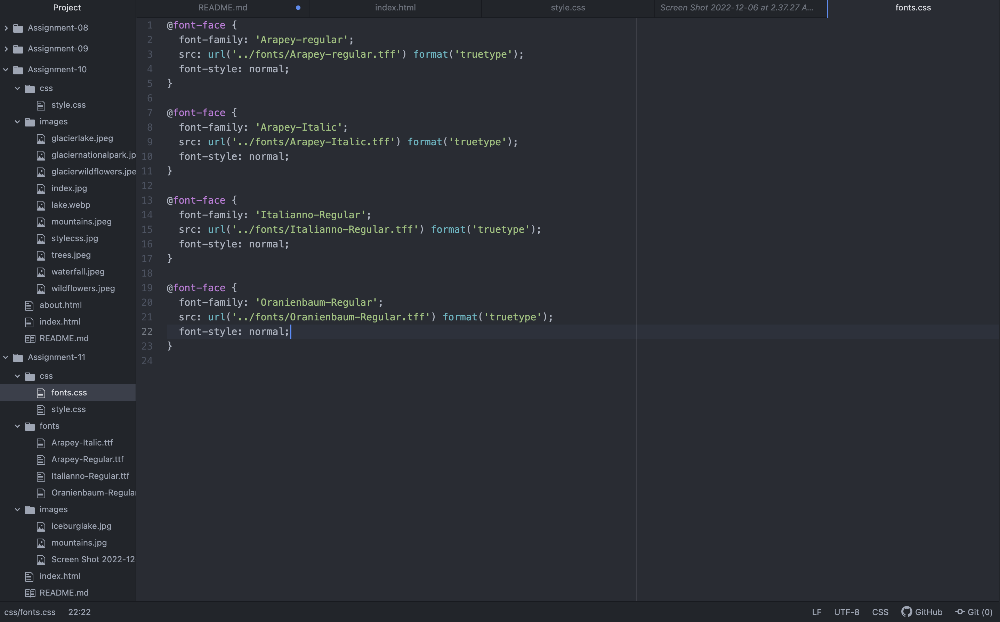

The importance of having a font stack is to let the browser know our preffered and fall back fonts if the style cannont be made.

the difference in a system font and web font is that the a desktop font is already installed on the computer and ready for use. Where as the web font needs to be downloaded. web-safe are already pre loaded on the computer.

