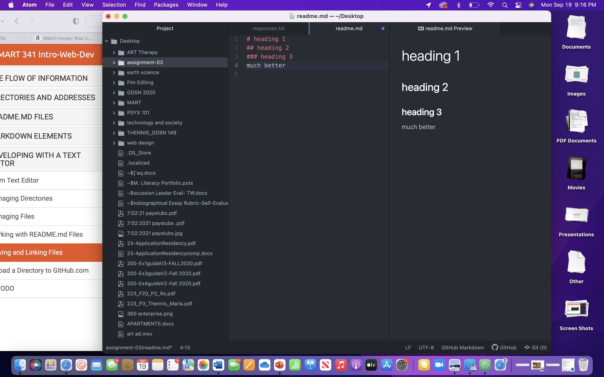

# heading 1
## heading 2
### heading 3
much better

[my responses](./responses.txt  )

 I have learned what the internet does and that there are so many things that go into it, 1. there is wireless internet that uses radio signals. 2. that BITs make up BYTEs and 3. that IP adresses are 128 bits and that the domain names are specific to the IP adresses. 
