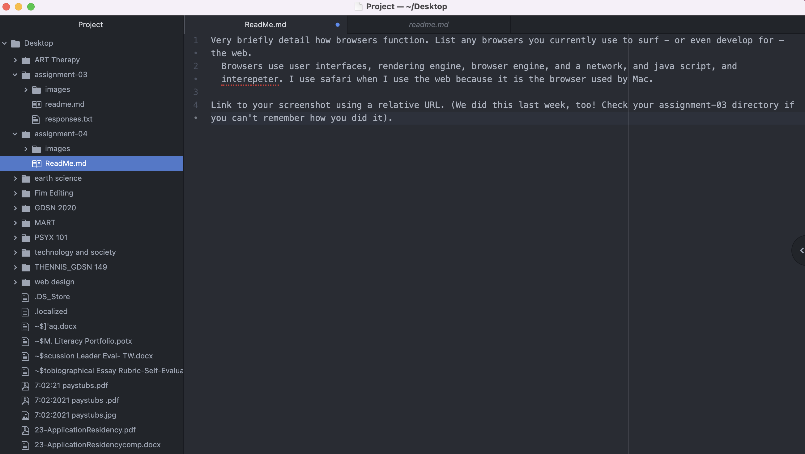
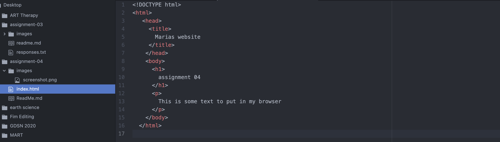

Very briefly detail how browsers function. List any browsers you currently use to surf - or even develop for - the web.
  Browsers use user interfaces, rendering engine, browser engine, and a network, and java script, and interepeter. I use safari when I use the web because it is the browser used by Mac.

Link to your screenshot using a relative URL. (We did this last week, too! Check your assignment-03 directory if you can't remember how you did it).

